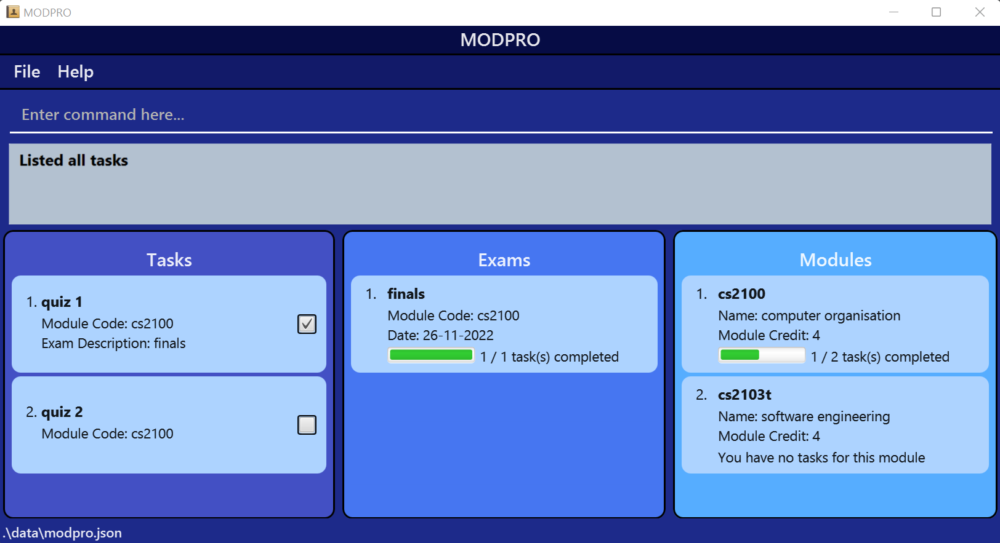

MODPRO is a desktop application which helps NUS students in tracking the progress of their modules. It is highly optimised for students who prefer Command Line Interface (CLI) by allowing those who type fast to key in commands to track their modules. It also provides a Graphic User interface(GUI) for those who prefer it.

## Table of Contents
- [Quick Start](#quick-start)
- [Features](#features)
  - [Adding task functions](#adding-task-functions-coming-soon-in-v12)
  - [Tagging priority of task](#tagging-priority-of-task-coming-soon-in-v12)
  - [List](#list-coming-soon-in-v12)
  - [Marking a task as complete](#marking-a-task-as-complete-coming-soon-in-v12)
  - [Deleting task function](#deleting-task-function-coming-soon-in-v12)

--------------------------------------------------------------------------------------------------------------------

## Quick start 

1. Ensure you have Java `11` or above installed in your Computer.

2. Download the latest `modpro.jar` from [here](https://github.com/AY2223S1-CS2103T-F11-2/tp).

3. Copy the file to the folder you want to use as the _home folder_ for MODPRO.

4. Double-click the file to start the app. The GUI similar to the below should appear in a few seconds.  
   

5. Refer to the [Features](#features) below for details of each command.

--------------------------------------------------------------------------------------------------------------------

## Features

### Adding task functions [Coming Soon in v1.2]
Adds task into task list

Format: `task m/MODULE d/DESCRIPTION`
* Adds a task to the end of the task list
* Module refers to the module which the task belongs to
* Description refers to the task description to be shown
* If the task module is empty or does not exist in module list, an error message will be displayed
* If the task description is empty, an error message will be displayed to inform the user to enter a description

Examples:

`task m/CS2105 d/Assignment 1` adds CS2105 Assignment 1 task into task list

`task m/CS2103T d/Quiz` adds CS2103T Quiz task into task list

### Tagging priority of task [Coming Soon in v1.2]
Tags the priority to complete task 

Format: `tag TASK /p PRIORITY_STATUS`
* Tags one of three priorities("high", "medium", "low") to the task
* If the priority status is not "high", "medium" or "low", an error message will appear to inform the user to key in a valid priority status

Examples:

`tag CS2105 Quiz /p high` tags CS2105 Quiz as high priority task to complete

`tag CS2103T Quiz /p low` tags CS2103T Quiz as low priority task to complete

### List [Coming Soon in v1.2]
List tasks stored in task list

Format: `list`
* Display tasks that are stored in the task list

Examples:

`list` displays tasks that are stored in the task list

### Marking a task as complete [Coming Soon in v1.2]
Marks the specified task as complete

Format: `mark INDEX`
* Marks the task at the specified INDEX as complete. 
* The index refers to the index number shown in the task list. 
* The index must be a positive integer 1, 2, 3, …​
* If the index is non-positive or more than the number of tasks in the list, an error message will be displayed.

Examples:

`mark 1` marks the first task in the list as complete.

`mark 3` marks the third task in the list as complete.

### Deleting task function [Coming Soon in v1.2]
Deletes the specified task according to the index given

Format: `delete INDEX`
* Deletes the task at the specified index from the storage
* The index refers to the index number shown in the task list.
* The index must be a positive integer 1, 2, 3, …​
* If the task list is empty and the user inputs any number, an error message will be displayed.
* If the index is non-positive or more than the number of tasks in the list, an error message will be displayed.

Examples:

`delete 1` deletes the first task in the task list

`delete 3` deletes the first task in the task list

--------------------------------------------------------------------------------------------------------------------

## Summary of Commands
| Command    | Format and Examples                                                                   |
|------------|---------------------------------------------------------------------------------------|
| **Add**    | **Format**: `add TASK`  **Example**: `add CS2105 Assignment 1`                    |
| **Tag**    | **Format**: `tag TASK /p PRIORITY_STATUS`  **Example**: `tag CS2105 Quiz /p high` |
| **List**   | **Format**: `list`  **Example**:`list`                                            |
| **Mark**   | **Format**: `mark INDEX`  **Example**:`mark 1`                                    |
| **Delete** | **Format**: `delete INDEX`  **Example**:`delete 1`                                |
